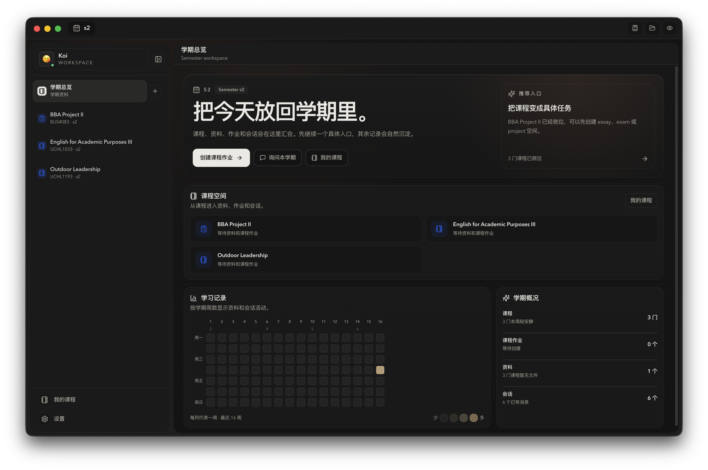
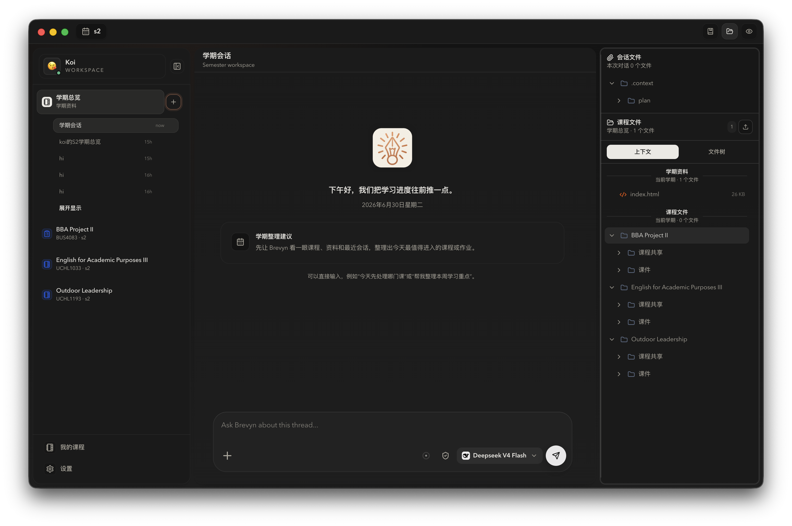
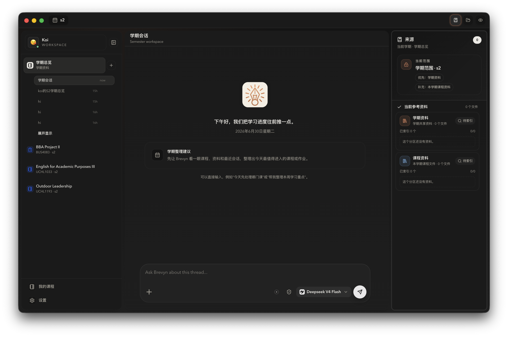

# Brevyn Community

<p align="center">
  <a href="https://github.com/KOIAI777/brevyn/stargazers">
    
  </a>
</p>

<p align="center">
  <strong>中文</strong> | <a href="./README.en.md">English</a>
</p>

Brevyn Community 是 Brevyn 的开源、本地优先桌面工作台。它把课程资料、任务、Office/PDF 预览、知识检索、对话和 Agent 工作流放在同一个学期工作区中。模型能力由用户通过 BYOK Provider 自行配置。



## 版本与下载

| 版本 | 适合场景 | 模型与服务 | 下载 |
| --- | --- | --- | --- |
| Brevyn Community | 希望查看源码、自行构建或参与贡献 | 用户自行配置 Agent、Embedding、Vision 和 OCR Provider | [下载 Community 最新版](https://github.com/KOIAI777/brevyn/releases/latest) |
| Brevyn Official | 希望直接安装、使用官方账号与自动更新 | 支持 Brevyn 官方服务，也可配置第三方 Provider | [下载 Official 最新版](https://github.com/KOIAI777/brevyn-releases/releases/latest) |

两个版本使用独立的 App ID、数据目录和更新源，可以同时安装。Community 的源码、Issue 和贡献流程均在本仓库维护；Official 安装包由独立的公开 Release 仓库分发。

## 功能概览

- 学期与课程工作区：按学期组织课程、课程资料、课程作业和会话。
- 任务化对话：每个作业可以拥有独立会话，方便围绕 essay、presentation、project 或 exam 持续推进。
- 课程文件管理：支持导入、预览、打开、重命名、删除和重新索引课程文件。
- 文件预览：支持 PDF、Word、PowerPoint、Excel、图片和常见文本文件预览。
- 解析与 Embedding 管线：本地解析 PDF、PPTX、DOCX、文本和代码文件；扫描件、截图和图片型资料可接入 OCR / MinerU 解析，再切分、向量化并写入检索索引。
- 课程资料检索：将课程文件纳入本地知识库，在对话中检索并引用相关片段。
- 引用到对话：从文件预览中选择文本片段，并添加到当前对话作为上下文。
- 多模态输入：支持图片附件预览和视觉模型配置。
- Agent 会话：基于 Claude Agent SDK 的对话与工具调用工作流。
- 分叉对话：从已有消息处分叉出新的会话，保留上下文脉络继续探索。
- 工作区记忆：支持学期、课程和任务范围的长期记忆设置。
- Skill 系统：内置写作、研究、文档处理、学术工作流等技能，并支持启用、停用和自定义分类。
- MCP 设置：可在应用内管理 MCP 服务配置。
- BYOK 模型配置：支持自定义 Agent、Embedding、Vision 和 OCR Provider。
- 独立更新：Community 构建只读取公开仓库的 Community Release，不连接 Brevyn Official 更新源。

## 典型工作流

1. 创建或选择一个学期。
2. 添加课程，并为课程导入资料。
3. 为课程创建作业任务，例如 essay、presentation 或 project。
4. 在任务下创建会话，让 Brevyn 检索课程资料并协助分析、写作或整理。
5. 在文件预览中选择关键片段，直接添加到当前对话。
6. 使用 Skill、MCP、记忆和分叉会话扩展复杂任务的处理能力。

## 内置能力

### 课程与任务

Brevyn 以学期为顶层工作区。每个学期下可以管理多门课程，每门课程下可以创建多个作业任务。任务与会话绑定后，资料、上下文和讨论会自然聚合到对应作业里。

### 文件与引用

课程文件可以被导入到课程共享区或任务区。Brevyn 会为文件生成可检索内容，并在对话中提供课程资料引用。用户也可以在预览中手动选择片段，把它添加到当前对话中。

### 解析、OCR 与 Embedding 管线

Brevyn 的课程资料会先进入本地解析管线。文本型文件会直接抽取正文；PDF、PPTX、DOCX 等文档会被拆成适合检索的片段；扫描件、截图和图片型资料可以接入 OCR / MinerU 解析，把页面内容转换为可检索文本。

解析后的内容会进入索引队列，按课程和任务范围切分 chunk，生成 Embedding，并写入向量索引和文本检索索引。资料更新后可以重新索引，让 Agent 在回答时优先召回当前课程或作业范围内的文件证据。





### Agent 与 Skill

Brevyn 使用 Agent 会话处理复杂学习任务。内置 Skill 可以帮助完成论文阅读、学术写作、文献整理、PPT 生成、数据处理和其他学习场景。

### 内置 Skills 与来源

Brevyn 默认内置文档处理、PPT、表格、PDF 和学术研究类 Skills。PPT 生成工作流基于 [ppt-master](https://github.com/hugohe3/ppt-master)。
### 记忆与上下文

Brevyn 支持不同范围的记忆设置。稳定偏好、项目规则、长期写作要求和容易重复的流程可以沉淀到工作区记忆中，帮助后续会话保持一致。

### Community 与 Official

本仓库不包含 Brevyn Official 的账号、计费、钱包、订阅、兑换码或官方模型供应逻辑。Community 与 Official 使用不同的 App ID、安装包和更新源，可以独立安装和维护。

## 开发

环境要求：

- Node.js 22 或更高版本
- Python 3.9 或更高版本
- Git
- LibreOffice：基础开发可选；构建或验证高保真 Office 预览时需要可用 runtime

安装锁定版本的依赖：

```bash
npm ci
```

启动开发环境：

```bash
npm run dev
```

类型检查：

```bash
npm run typecheck
```

完整发布前验证（类型、Skills、Python、测试与构建）：

```bash
npm run verify
```

构建应用：

```bash
npm run build
```

macOS 打包：

```bash
npm run dist:mac
```

## 文档

- [贡献指南](CONTRIBUTING.md)
- [贡献者许可协议](CLA.md)
- [安全策略](SECURITY.md)
- [架构说明](docs/architecture.md)
- [Claude Agent SDK 设置](docs/agent-sdk-setup.md)
- [OpenAI Responses Anthropic Adapter](docs/openai-responses-anthropic-adapter.md)

## Star History

<a href="https://www.star-history.com/?repos=KOIAI777%2Fbrevyn&type=date&legend=top-left">
 <picture>
   <source media="(prefers-color-scheme: dark)" srcset="https://api.star-history.com/svg?repos=KOIAI777/brevyn&type=Date&theme=dark" />
   <source media="(prefers-color-scheme: light)" srcset="https://api.star-history.com/svg?repos=KOIAI777/brevyn&type=Date" />
   
 </picture>
</a>

## 当前状态

Brevyn Community 目前处于早期版本，功能、界面和内置工作流仍在快速迭代中。
