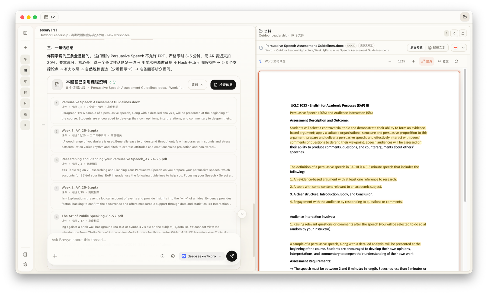
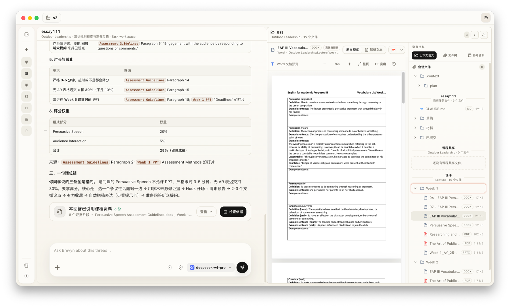
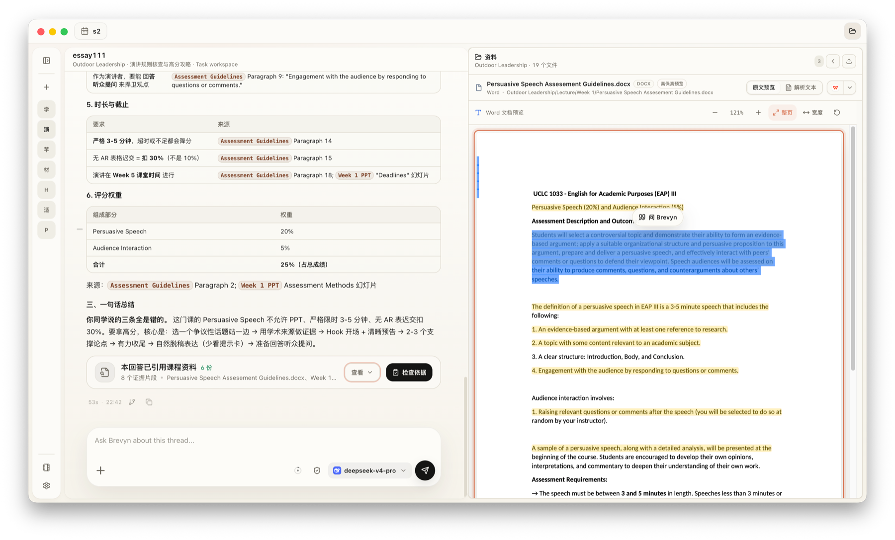
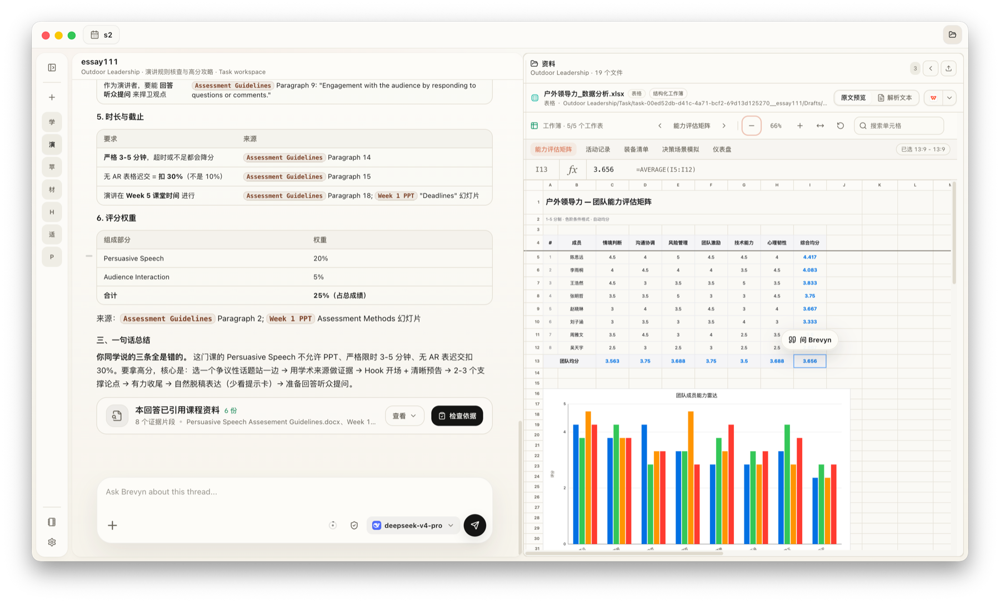

# Brevyn Community

<p align="center">
  <a href="https://github.com/KOIAI777/brevyn/stargazers">
    
  </a>
  <a href="https://github.com/KOIAI777/brevyn/releases/latest">
    
  </a>
  <a href="./LICENSE">
    
  </a>
</p>

<p align="center">
  <strong>中文</strong> | <a href="./README.en.md">English</a>
</p>

Brevyn Community 是 Brevyn 的开源、本地优先桌面工作台。它把课程资料、任务、Office/PDF 预览、知识检索、来源引用、对话与 Agent 工作流放在同一个学期工作区中。模型能力由用户通过 BYOK Provider 自行配置。

<p align="center">
  <a href="https://www.brevyn.org/">官网</a> ·
  <a href="https://www.brevyn.org/#download">全部下载</a> ·
  <a href="https://github.com/KOIAI777/brevyn/releases/latest">Community Release</a> ·
  <a href="./CONTRIBUTING.md">参与贡献</a>
</p>


## 从资料到可核查回答

Brevyn 会在课程与任务范围内检索已索引资料。回答中的来源可以回到对应文件、页面、幻灯片或内容区域，方便继续阅读和核查，而不是停留在一段脱离原文的摘要里。



## 在同一个工作区阅读和引用

### 按课程结构整理资料

文件树按课程、周次和任务组织资料。预览与对话并排存在，切换文件时不需要离开当前学习上下文。



### 从原文发起追问

在预览中选中段落或内容区域后，可以把它作为明确上下文交给当前会话，减少文件名、页码和段落位置的重复说明。



### 预览 Office 与 PDF 文件

内置预览覆盖 PDF、DOCX、PPTX、XLSX、图片和常见文本文件。表格预览保留工作表、单元格选择、公式信息与常见图表，便于后续分析和引用。



## 核心能力

- **课程与任务工作区**：按学期组织课程、共享资料、作业任务和持续会话。
- **资料解析与索引**：解析 PDF、PPTX、DOCX、XLSX、文本和代码文件；扫描件与图片型资料可接入 OCR / MinerU。
- **检索与来源定位**：将解析内容写入向量与文本索引，并从检索结果回到原始文件位置。
- **文件预览与引用**：在预览中选择内容、加入对话，并在多个资料标签之间切换。
- **Agent、Skill 与 MCP**：用工具调用、内置学习 Skills、工作区记忆和 MCP 扩展复杂流程。
- **本地优先与 BYOK**：自行配置 Agent、Embedding、Vision 和 OCR Provider；Community 使用独立的数据目录与公开更新源。

## 版本与下载

| 版本 | 适合场景 | 模型与服务 | 获取方式 |
| --- | --- | --- | --- |
| Brevyn Community | 查看源码、自行构建、配置 BYOK Provider 或参与贡献 | 用户自行配置 Agent、Embedding、Vision 和 OCR Provider | [Community Release](https://github.com/KOIAI777/brevyn/releases/latest) |
| Brevyn Official | 直接安装并使用官方账号、模型服务和自动更新 | 支持 Brevyn 官方服务，也可配置第三方 Provider | [官网下载](https://www.brevyn.org/#download) |

两个版本使用独立的 App ID、数据目录和更新源，可以同时安装。本仓库不包含 Official 的账号、计费、钱包、订阅、兑换码或官方模型供应逻辑。

### Community 支持平台

| 平台 | 架构 | 安装包 | 说明 |
| --- | --- | --- | --- |
| macOS | Apple Silicon (arm64) | DMG / ZIP | 暂不支持 Intel Mac |
| Windows | x64 | Setup EXE | 当前未进行 Windows 代码签名，首次运行可能出现 SmartScreen 提示 |

下载速度较慢时，可从 [Brevyn 官网](https://www.brevyn.org/#download) 使用 Community 加速下载；所有发行文件与版本说明仍可在 [GitHub Releases](https://github.com/KOIAI777/brevyn/releases) 查看。

## 开源发展方向

### 正在完善

- 从作业说明和 Rubric 中提取截止时间、格式、限制与评分维度，并形成可回溯原文的核查清单。
- 加强多资料阅读、交叉验证、观点对比与引用定位，服务普通学习和轻量研究场景。
- 继续提高 PDF 与 Office 预览、文本选择、来源高亮和跳转的准确性。
- 完善表格公式、图表对象和数据分析工作流，让 XLSX 不只是可预览，也能被 Agent 稳定理解和处理。

### 欢迎参与的方向

- LaTeX、参考文献与研究写作工作流。
- 数据集、统计分析与可复现分析报告。
- 文件解析、Office 对象模型、预览兼容性和跨平台打包。
- 可复用的学习 Skills、MCP 服务与专业工具集成。

> 路线图表示当前维护方向，不代表发布日期或交付承诺。开始较大改动前，请先通过 Issue 讨论范围与实现边界。

## 本地开发

环境要求：

- Node.js 22 或更高版本
- Python 3.9 或更高版本
- Git
- LibreOffice：基础开发可选；构建或验证高保真 Office 预览时需要可用 runtime

```bash
npm ci
npm run dev
```

常用检查与构建命令：

```bash
npm run typecheck
npm run verify
npm run build
npm run dist:mac
```

## 贡献与文档

- [贡献指南](CONTRIBUTING.md)
- [贡献者许可协议](CLA.md)
- [支持与问题反馈](SUPPORT.md)
- [社区行为准则](CODE_OF_CONDUCT.md)
- [安全策略](SECURITY.md)
- [Community 与 Official 维护边界](docs/edition-maintenance.md)
- [架构说明](docs/architecture.md)
- [Claude Agent SDK 设置](docs/agent-sdk-setup.md)
- [OpenAI Responses Anthropic Adapter](docs/openai-responses-anthropic-adapter.md)
- [ppt-master](https://github.com/hugohe3/ppt-master) 提供了内置 PPT 生成工作流的基础，原始许可见 [default-skills/ppt-master/LICENSE](./default-skills/ppt-master/LICENSE)

## Star History

<a href="https://www.star-history.com/?repos=KOIAI777%2Fbrevyn&type=date&legend=top-left">
 <picture>
   <source media="(prefers-color-scheme: dark)" srcset="https://api.star-history.com/chart?repos=KOIAI777/brevyn&type=date&theme=dark&legend=top-left&sealed_token=TIGcFm1zpKrJWXBtEIYTqBP88gIyFhelK1hm1MY-1D6qv9Bd0r0MGQv_t9B7h3FBM6xIKmyqmRbPgbGjxbK-ILhjPSY8EikOOBldd11Aq6LR73xScgmEo9y9RP37wG_SpFjBN880w3y7lUSIZmRwVrEIpKaBmIpuMoOPsnnCMri4qfCUrAHwA4TXwLe1" />
   <source media="(prefers-color-scheme: light)" srcset="https://api.star-history.com/chart?repos=KOIAI777/brevyn&type=date&legend=top-left&sealed_token=TIGcFm1zpKrJWXBtEIYTqBP88gIyFhelK1hm1MY-1D6qv9Bd0r0MGQv_t9B7h3FBM6xIKmyqmRbPgbGjxbK-ILhjPSY8EikOOBldd11Aq6LR73xScgmEo9y9RP37wG_SpFjBN880w3y7lUSIZmRwVrEIpKaBmIpuMoOPsnnCMri4qfCUrAHwA4TXwLe1" />
   
 </picture>
</a>

## 当前状态

Brevyn Community 仍处于早期版本。功能、界面和内置工作流会持续迭代，安装前请查看对应版本的 Release Notes 和已知限制。
